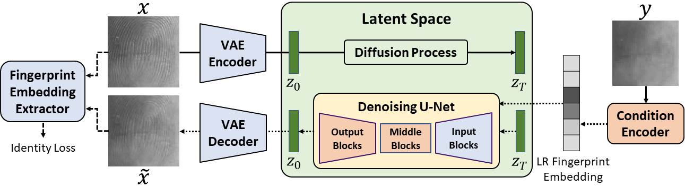

## Diffusion-Based Super-Resolution

## 💡 : Method

We adopt an identity-guided conditional latent diffusion architecture for fingerprint super-resolution. Specifically, We use the pretrained AutoencoderKL from Stable Diffusion as the variational autoencoder (VAE) and fine-tune it on HR fingerprint images. The VAE is then frozen during the training/inference of the latent diffusion model and encodes the HR fingerprint image into a compact latent representation. During super-resolution, the LR fingerprint reconstructed by SPI is processed by a lightweight trainable condition encoder to produce conditioning embeddings. A denoising network–which is the pretrained U-Net adopted from Stable Diffusion with its input blocks frozen while the middle and output blocks trainable–then performs iterative conditional denoising in the latent domain, starting from Gaussian noise and progressively refining the latent code under the guidance of the conditioning embeddings and diffusion timestep embeddings. The final latent representation is decoded by the frozen VAE decoder to obtain a HR fingerprint. 

## ⚙ : Setup
First create a new conda environment

    conda env create -f environment.yml
    conda activate ldm

## ☕️ : Training
You should first download the pretrained weights of [Stable Diffusion](https://huggingface.co/stable-diffusion-v1-5/stable-diffusion-v1-5/blob/main/v1-5-pruned.ckpt) and put it to `./ckpt/` folder. Then, you can get the initial weights for training by:

    python utils/prepare_weights.py init ckpt/v1-5-pruned.ckpt configs/config.yaml ckpt/init.ckpt

The 4 arguments are mode, pretrained SD weights, model configs and output path for the initial weights.

Now, you can train the fingerprint super-resolution by:

    python src/train/train.py

## 💻 : Evaluation
You can evaluate the fingerprint super-resolution by:

    python src/test/test.py
