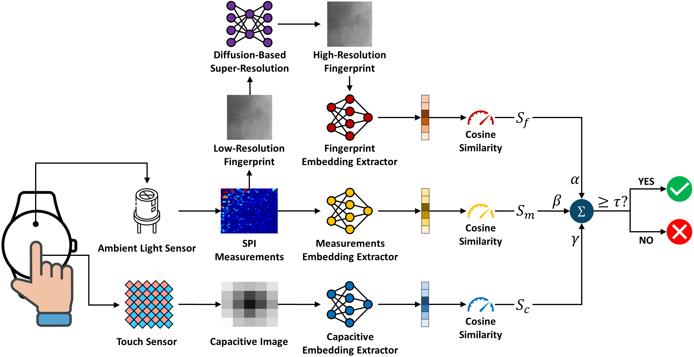

## SPI-Print: Single-Pixel Imaging–Based Fingerprint Authentication on Smartwatches
## 🏛️ : Architecture

SPI-Print adopts a single-pixel imaging (SPI)-based method for fingerprint scanning and a touch sensor-based method for liveness detection.

## ⚙ : Implementation
During authentication, the user places their finger on the smartwatch screen. A series of Hadamard patterns are projected by the smartwatch's display to illuminate the user's finger and the reflected-light intensity of each pattern is recorded by the smartwatch's ambient light sensor, whose readings are then logged to derive the SPI measurements. Next, inverse Hadamard transform is applied to such measurements to recover the low-resolution (LR) fingerprint, which is passed through ***Diffusion-Based Super-Resolution*** to reconstruct the high-resolution (HR) fingerprint. In the meantime, raw data are logged from the smartwatch's touch sensor to obtain the capacitive image of the user's finger pressed on the screen. In the next step, ***Fingerprint Embedding Extractor***, ***Measurements Embedding Extractor***, and ***Capacitive Embedding Extractor*** are applied to the reconstructed HR fingerprint, SPI measurements, and capacitive image, respectively, to extract the corresponding embeddings, which are combined via a score-level fusion to make the final authentication decision.

To implement SPI-Print, you need to (1) first train the three embedding extractors and (2) then train the super-resolution model. Training and evaluation instructions are detailed in each subfolder's **README.md** file.
